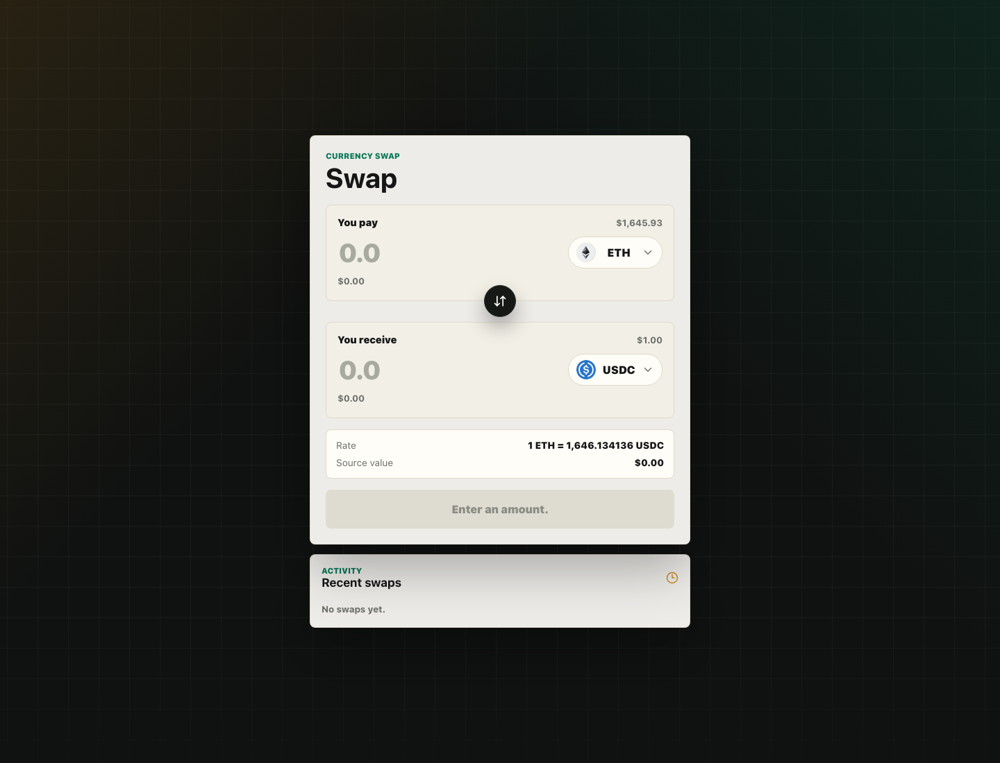

# Currency Swap Form

Frontend submission for the 99Tech currency swap challenge. The app is a focused swap form built with Vite, React, and TypeScript.

Live demo: https://crypto-change-99tech.vercel.app/



## Overview

Users can select two currencies, enter either the send or receive amount, and preview the calculated exchange amount before confirming a simulated swap. The form uses the challenge price API for token prices and the Switcheo token icon repository for token images.

## Features

- Two-field swap form: `You pay` and `You receive`
- Searchable token dropdowns
- Token icons with graceful fallback initials
- Live exchange-rate calculation
- Bidirectional amount calculation
- Same-token selection prevention
- Input validation and clear error states
- Simulated submit loading state
- Success message after confirmation
- Recent swap history
- Responsive UI
- Smooth animations with `prefers-reduced-motion` support

## Data Handling

Prices are loaded from:

```txt
https://interview.switcheo.com/prices.json
```

Expected API shape:

```ts
type PriceRecord = {
  currency: string;
  date: string;
  price: number;
};
```

Processing rules:

- Invalid, missing, or non-positive prices are omitted.
- Duplicate currencies are grouped by `currency`.
- The newest `date` is used.
- If duplicate records share the same `date`, the later record from the API response wins.
- Swap rate is calculated as `fromToken.price / toToken.price`.

Token icons are loaded from:

```txt
https://raw.githubusercontent.com/Switcheo/token-icons/main/tokens/{currency}.svg
```

If an icon cannot be loaded, the UI displays token initials instead.

## Important Assumptions

- The swap is simulated client-side.
- The API only provides token price data, so the UI does not invent fees, slippage, liquidity, balances, or on-chain execution details.
- Recent swap history is local UI state and resets on page refresh.

## Tech Stack

- Vite
- React
- TypeScript
- CSS
- lucide-react

## Project Structure

```txt
src/
  components/
    StatusMessage.tsx
    SwapForm.tsx
    SwapHistory.tsx
    TokenAmountInput.tsx
    TokenSelect.tsx
  hooks/
    useSwapHistory.ts
    useSwapQuote.ts
    useTokenPrices.ts
  lib/
    format.ts
    tokens.ts
    validation.ts
  types/
    swap.ts
  App.tsx
  main.tsx
  index.css
```

## Run Locally

```bash
npm install
npm run dev
```

Open the local Vite URL, usually:

```txt
http://localhost:5173
```

## Build

```bash
npm run build
```

Preview production build:

```bash
npm run preview
```

## Deployment

Deployed on Vercel:

```txt
https://crypto-change-99tech.vercel.app/
```
